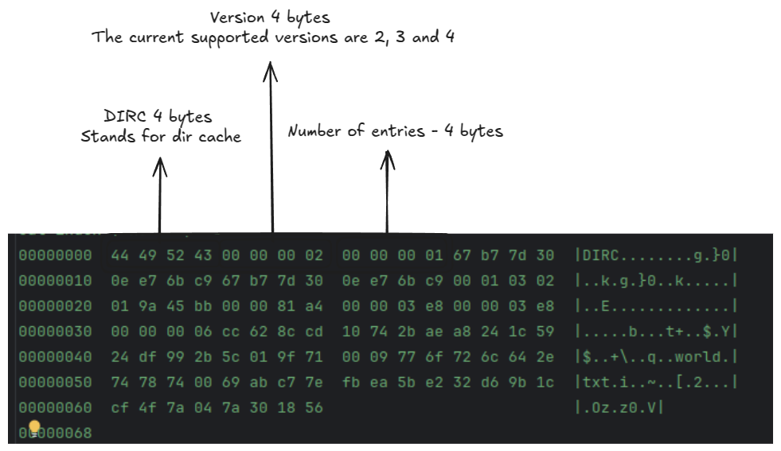

## Index ( .git/index )

- Stored in `.git/index` file
- Serves as a caching layer before we commit files 

### Header
```
cat index | hexdump -C
00000000  44 49 52 43 00 00 00 02  00 00 00 01 67 b7 7d 30  |DIRC........g.}0|
00000010  0e e7 6b c9 67 b7 7d 30  0e e7 6b c9 00 01 03 02  |..k.g.}0..k.....|
00000020  01 9a 45 bb 00 00 81 a4  00 00 03 e8 00 00 03 e8  |..E.............|
00000030  00 00 00 06 cc 62 8c cd  10 74 2b ae a8 24 1c 59  |.....b...t+..$.Y|
00000040  24 df 99 2b 5c 01 9f 71  00 09 77 6f 72 6c 64 2e  |$..+\..q..world.|
00000050  74 78 74 00 69 ab c7 7e  fb ea 5b e2 32 d6 9b 1c  |txt.i..~..[.2...|
00000060  cf 4f 7a 04 7a 30 18 56                           |.Oz.z0.V|
00000068
```

